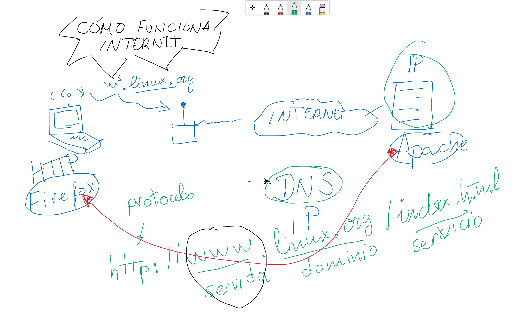
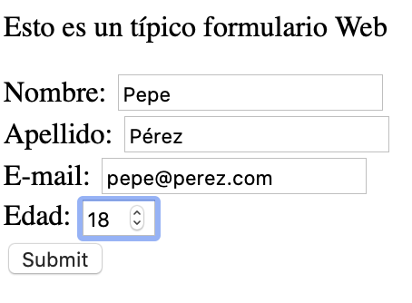
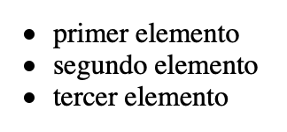
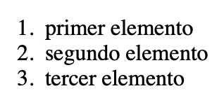

# Semana 1: HTML5 - Sintaxis básica y tablas

## ¿Cómo funciona Internet?

Cuando queremos visitar una página Web normalmente nos vamos a nuestro buscador favorito y hacemos la consulta. Pero si nos fijamos en la barra de direcciones, cuando estamos en esa Web, ahí hay escrito lo que llamamos un **identificador uniforme de recurso o URL** (Uniform Resource Locator), es decir una dirección que nos permite acceder de forma inequívoca a un recurso de un determinado servidor.

El formato general de un URL es:

> **protocolo://máquina.directorio.archivo**

aunque también pueden añadirse otros datos:

> **protocolo://usuario:contraseña@máquina:puerto.directorio.archivo**.

Por ejemplo: [https://es.wikipedia.org/wiki/Localizador_de_recursos_uniforme](https://es.wikipedia.org/wiki/Localizador_de_recursos_uniforme):

* **https** es el protocolo
* **es** es el servidor para España de Wikipedia
* **wikipedia.org**  es el dominio donde está la página
* **/wiki/Localizador_de_recursos_uniforme** es el archivo que estamos consultando

[](https://www.youtube.com/watch?v=Lec6zX1tdak)

Normalmente confundimos Internet con la World Wide Web ó WWW. [Como podemos leer en Wikipedia](https://es.wikipedia.org/wiki/World_Wide_Web), el World Wide Web (WWW) o red informática mundial​ es un sistema de distribución de documentos de hipertexto o hipermedia interconectados y accesibles a través de Internet. Con un navegador web, un usuario visualiza sitios web compuestos de páginas web que pueden contener textos, imágenes, vídeos u otros contenidos multimedia, y navega a través de esas páginas usando hiperenlaces.

## Lenguajes de marcas

HTML es un [lenguaje de marcas](https://es.wikipedia.org/wiki/Lenguaje_de_marcado), es decir, que usamos unas etiquetas predefinidas para dar estructura o significado al texto de la página.

En un PC sabemos que un archivo es de este tipo porque **normalmente usa la extensión html o html**.

Ejemplos:

```html
<h1> Esto es un título</h1>
<p> Esto es un párrafo </p>
```

[HTML5 es la última versión](https://developer.mozilla.org/es/docs/HTML/HTML5) de este lenguaje, que intenta diferenciarse de versiones anteriores porque sus etiquetas van tomando un valor más semántico (explican qué tipo de contenido contienen), dejando a las hojas de estilo ( [CSS3 o Cascade Style Sheets versión 3](https://developer.mozilla.org/es/docs/Archive/CSS3), ya las veremos más adelante).

## Primer ejemplo

```html
<!DOCTYPE html>
<html lang="es">
    <head>
        <meta charset="utf-8"> 
    </head>
    <body>
        Aquí va el texto que vemos en el navegador.
    </body>
</html>
```

## Etiquetas más comunes de HTML

### Las nuevas etiquetas de HTML5

Como decíamos con anterioridad, HTML5 plantea un [nuevo esquema y secciones de un documento](https://developer.mozilla.org/es/docs/Sections_and_Outlines_of_an_HTML5_document): \<section>, \<article>, \<nav>, \<header>, \<footer>, \<aside>.

### Estructura básica

Sea el siguiente ejemplo adaptación de los [tutoriales de Mozilla](https://developer.mozilla.org/es/docs/Sections_and_Outlines_of_an_HTML5_document):

```html
<!DOCTYPE html>
<html lang="es">
    <head>
        <meta charset="utf-8"> 
    </head>
    <body>
        <nav>

        </nav>
        <section>
            <h1>El fiero conejo</h1>
        <section>
            <h1>Introducción</h1>
            <p>En esta sección presentamos al conocido mamífero.
        </section>
        <section>
            <h1>Hábitat</h1>
            <p>El conejo, como fiero depredador, necesita un entorno con abundantes zorros que cazar.
        </section>
        <aside>
            <p>otros estudiosos del conejo
        </aside>
        </section>
        <footer>
        <p>2010 The Example company
        </footer>
 </body>
</html>
```

En el anterior ejemplo tenemos que:

* La etiqueta \<!DOCTYPE html> indica que se trata de un documento HTML.
* La etiqueta \<html lang="es"> y su pareja que cierra al final \</html> sirven para indicar que dentro está el documento HTML. Fíjate en el atributo **lang="es"**, sirve para indicar que el documento está en español. Si lo cambiamos por **lang="en"**, ¿qué idioma crees que sería el del documento? Correcto, inglés (**En**glish).
* \<header> y \</header>: sirven para definir un bloque de contenido que hará las veces de título de la página web.
* \<footer> y \</footer>: define el pie de página de nuestra web.
* \<nav> y \</nav>: donde incluiremos diferentes enlaces para que el usuario pueda desplazarse entre las partes de nuestro sitio web.
* \<section> y \</section>: para definir grandes secciones de nuestra página.
* \<article> y \</article>: marca los límites de un contenido específico, como una entrada de un blog o un artículo en general.
* \<aside> y \</aside>: se emplea para definir un contenido que está relacionado con la página, pero que se debe considerar como separado del contenido principal.


Los elementos en HTML usualmente son bien elementos "en línea" o bien elementos a "nivel de bloque". Un elemento en línea ocupa sólo el espacio acotado por las etiquetas que lo definen. Un elemento en bloque pueden ser varias líneas.

### Títulos y párrafos

El lenguaje HTML es muy cuidadoso con la organización de la información, por lo que lo primero que debemos conocer es cómo estructurar los títulos y cómo definir los párrafos de texto. Esto serían elementos de bloque.

Para dar formato a una palabra o conjunto de palabras (negrita, cursiva, subrayado, tachado...) usamos etiquetas que definen elementos "en línea".

#### Párrafos

Las etiquetas \<p> y \</p> se emplean para definir un bloque de texto que se comporta como un párrafo. Normalmente no dejaremos nunca una porción de texto suelta por la página web, sino que la rodearemos con esas etiquetas. El editor de texto se encargará de hacerlo por nosotros pero, si estamos usando otro tipo de editor, debemos asegurarnos de qué sucede.

#### Títulos

Las etiquetas \<h1> y \</h1> se utilizan para definir un texto como título, indicando que es una cabecera (la h viene de header, cabecera en inglés) que queremos destacar sobre el resto del texto. Junto a \<h1> contamos con \<h2>, \<h3> y así hasta \<h6> para definir diferentes títulos, de mayor a menor importancia.

Una página web bien diseñada contará con estos encabezados para definir los distintos apartados del texto, con sus diferentes niveles. En la figura se puede observar cómo hemos incorporado algunos encabezados, en este caso h1 y h2, a nuestro texto. Se consigue añadiendo el texto y a continuación seleccionando el encabezado deseado en cuadro de la parte izquierda.

Cada uno de los niveles de encabezado tiene una apariencia diferente de tamaño y tipo de letra. Este aspecto se puede modificar como veremos un poco más tarde.
Saltos de línea y líneas separadoras

Para complementar las opciones de separación del texto, contamos con dos etiquetas más:

* \<br> inserta un salto de línea en el texto. No genera un nuevo párrafo, sino que parte la línea en dos. Es un elemento puntual, que no lleva etiqueta de cierre.
* \<hr> inserta un salto de línea en el texto, pero mostrando una línea horizontal visible.

### Formato de palabras

Aunque existen etiquetas para poner el texto en negrita: \<strong> o \<b>, cursiva \<i>, etc. hoy día ya están obsoletas en HTML5. Ahora deberíamos cercar con \<span>\</span> (de *abarcar* en inglés) el texto que queremos decorar y darle formato con CSS.

Ejemplos:

```html
   <p>
    Esto es un párrafo con el siguiente texto en rojo
     <span style="color: red;"> y esto un span dentro de un párrafo. </span>
   </p>
   <p>
    Y esto otro párrafo con el siguiente texto en negrita
    <span style="font-weight: bold;"> y esto un span dentro de un párrafo. </span>
   </p>
   <p>
    Y esto otro párrafo con el siguiente texto en cursiva
    <span style="font-style: italic;"> y esto un span dentro de un párrafo. </span>
   </p>
   <p>
    Y esto otro párrafo con el siguiente texto en negrita
    <span style="text-decoration:underline;"> y esto un span dentro de un párrafo. </span>
   </p>
```

Esto da lugar en un navegador a la siguiente salida:


### Hiperenlaces o anclas

El elemento ancla o hiperenlace \<a> crea un enlace a otras páginas de internet, archivos o incluso partes dentro de la misma página, direcciones de correo, o cualquier otra URL:

```html
<a href="https://www.youtube.com/juanguedu">Mi canal de Youtube</a>
```

### Imágenes

la etiqueta \ se emplea para insertar una imagen en la página web, pero por si sola no funciona correctamente. Necesita que le incorporemos un parámetro en el que indiquemos qué imagen será la que se muestre. Quedaría así:

```html

```

En el ejemplo siguiente, además de indicar qué imagen se mostrará, establecemos el tamaño que ocupará en la pantalla:

```html

```

### Uso de audio y video en HTML5

Los elementos [\<audio>](https://developer.mozilla.org/es/docs/Web/HTML/Elemento/audio) y [\<video>](https://developer.mozilla.org/es/docs/Web/HTML/Elemento/video) permiten la manipulacion de nuevo contenido multimedia.

Imagina que tienes un vídeo que has grabado con el móvil en formato MP4 (Android) o MOV (iPhone), ¿cómo insertarlo en una página Web? Sencillo, sería algo así:

```html
    <video src="mi_pelicula.mp4" autoplay poster="imagen_inicial.jpg">
         Su navegador no soporta la etiqueta video.
    </video>
```

Si nuestro navegador es moderno, veremos el vídeo, en caso contrario veríamos el mensaje *"Su navegador no soporta la etiqueta video"*.

### Formularios en HTML5

Cuando abres un navegador y vas a la página de tu buscador favorito, **eso es un formulario**, fíjate cómo hay una caja donde escribes el texto a buscar y luego un botón para enviar que pulsaremos para ir a la siguiente página con los resultados de la búsqueda.

Aquí tienes un ejemplo de formulario. Fíjate en la etiqueta \<input>. Verás que según el tipo de información que quieres consultar, es el atributo **type** de cada entrada de texto:

```html
<p>Esto es un típico formulario Web</p>
<form action="getform.php" method="get">
    <label>Nombre: <input type="text"></label><br>
    <label>Apellido: <input type="text"></label><br>
    <label>E-mail: <input type="email"></label><br>
    <label>Edad: <input type="number" min="18" max="120"><br>
    <input type="submit" value="Submit">
</form>
```

Esto dará lugar a un formulario como éste:



Además el trabajar con HTML5 nos ofrece otra ventaja como es [aprovechar su mejora de los formularios web](https://developer.mozilla.org/es/docs/HTML/HTML5/Formularios_en_HTML5): Validación de restricción (p.ej. si un campo es un número, podemos indicar entre qué números deberá estar comprendido), varios atributos nuevos, nuevos valores para \<input> como el atributo type y el nuevo elemento \<output>.

Observa cómo funciona esto de las restricciones en el ejemplo anterior cuando intentamos introducir una letra en la edad:


### Listas

Para declarar listas usamos o bien la etiqueta \<ol>\</ol> (*del inglés ordered list*) si queremos una lista numerada u **ordenada** o bien la etiqueta \<ul>\</ul>, si queremos una lista desordenada (del inglés *unordered list*).

El elemento \<li>\</li> del inglés **list item** o elemento de lista, declara cada uno de los elementos de una lista.

Ejemplo:

```html
<ul>
 <li>primer elemento</li>
 <li>segundo elemento</li>
 <li>tercer elemento</li>
</ul>
```

dará como salida:



Sin embargo, el siguiente ejemplo:

```html
<ol>
 <li>primer elemento</li>
 <li>segundo elemento</li>
 <li>tercer elemento</li>
</ol>
```

dará como salida:



¿Has visto la diferencia entre usar \<ol> y \<ul>?

### La etiqueta \<div>

En un documento HTML el elemento \<div> (del inglés division) permite crear divisiones, también llamadas secciones o zonas. Las divisiones se utilizan para agrupar elementos y aplicarles estilos. Es el contenedor genérico para dar diseño al contenido. Ejemplo:

```html
<div class="container">
  <div class="well">One</div>
  <div class="well">Two</div>
  <div class="well">Three</div>
  <div class="well">Four</div>
  <div class="well">Five</div>
  <div class="well">Six</div>
</div>
```

*Recuerda* este elemento porque vamos a usarlo muchas veces.

## Plantilla de una página Web con hiperenlaces

Ahora que ya tenemos una ligera noción de qué es eso del HMTL te proponemos el siguiente ejercicio: Vamos a crear una Web a partir del ejemplo de estructura básica. La página debe tener un título, un autor y al menos un hiperenlace. Recuerda guardar el archivo con la extensión html ("ejemplo.html").

### Editores de texto

Si no puedes localizar en el equipo un editor de texto plano con el que poder hacer las prácticas y tareas del proyecto, puedes instalar uno de los siguientes:

* [Microsoft Visual Studio Code](https://code.visualstudio.com/download) (si no lo quieres instalar también hay [opción de usarlo en modo "portable"](https://code.visualstudio.com/docs/editor/portable))
* [Geany](https://www.geany.org/download/releases/)
* [Notepad++](https://notepad-plus-plus.org/downloads/)

En los vídeos y en clase tenemos Visual Studio Code, luego ante duda te recomendamos ése.

En Windows, el más ligero y fácil de usar es Notepad++.

En Linux, el más sencillo es Geany.

Si no quieres instalar nada, puedes [trabajar on-line con alguna Web como CodePen](https://codepen.io/pen/).

¿Qué tal, has podido crear tu primera página Web, ha sido fácil?
