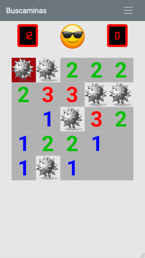
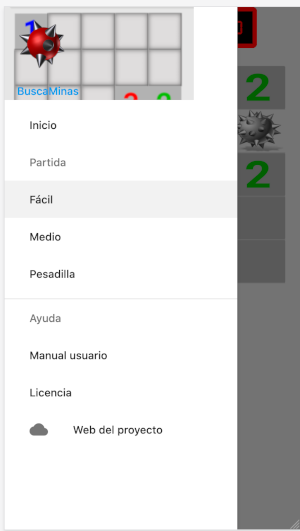
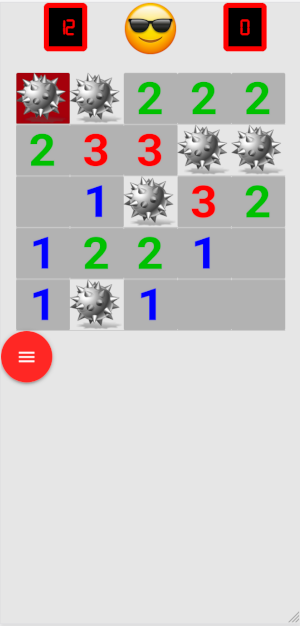
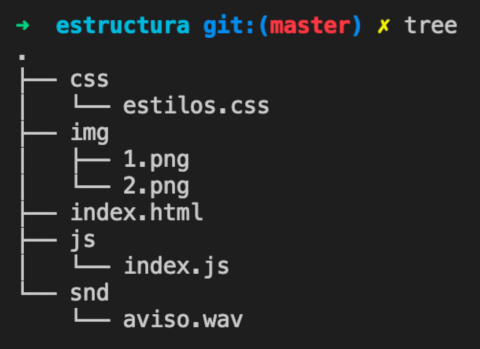

# Semana 3: CSS3 - Con un poco de estilo. Menús

Antes de avanzar en el tema de los estilos, queremos destacar que no se trata simplemente de "hacer bonitas" las páginas Webs o aplicaciones Web que diseñamos, también hay que trabajar la usabilidad y accesibilidad de las mismas.

## UI vs UX

Cuando usamos una aplicación o página Web, queremos que sea intuitiva, fácil de usar, rápida, sin comportamientos extraños o errores. Esto tiene que ver con la interfaz de usuario y la experiencia de usuario, dos conceptos muy importantes que debes conocer.

En el área del *márketing digital*, la experiencia de usuario o **UX** hace referencia a las interacciones que hace un usuario con una marca, sitio Web o aplicación. Su objetivo es conseguir que la interacción entre el cliente y nuestro producto o servicio sea agradable.

En el área de la *ingeniería de la usabilidad*, la interfaz de usuario o **UI** cobra especial importancia porque el diseño que hagamos de nuestro producto o Web, debe estar centrado y atractivo para el usuario. Debe ser fácil de aprender, usar y robusto (sin fallos ni comportamientos extraños, no previstos).

## Accesibilidad

Aunque se sale un poco del tema del curso, has de saber que existen una serie de normas tanto internacionales como locales sobre cómo hacer un sitio Web o una aplicación móvil accesibles a todo el mundo.

La **accesibilidad web** tiene como objetivo lograr que las páginas web sean utilizables por el máximo número de personas, independientemente de sus conocimientos o capacidades personales e independientemente de las características técnicas del equipo utilizado para acceder a la Web (Fuente: [Universidad de Alicante](http://accesibilidadweb.dlsi.ua.es)). Esto enlaza con uno de los objetivos esenciales de la Web que planteó su creador:

> "The power of the Web is in its universality. Access by everyone regardless of disability is an essential aspect" [Tim Berners-Lee](https://www.w3.org/Press/IPO-announce).

Una página Web accesible debería, al menos, de cumplir las siguientes pautas (fuente: [Universidad de Alicante](http://accesibilidadweb.dlsi.ua.es/?menu=guiabreve)):

1. Imágenes y animaciones: Use el atributo alt para describir la función de cada elemento visual.
2. Mapas de imagen: Use el elemento map y texto para las zonas activas.
3. Multimedia: Proporcione subtítulos y transcripción del sonido, y descripción del vídeo.
4. Enlaces de hipertexto: Use texto que tenga sentido leído fuera de contexto. Por ejemplo, evite "pincha aquí".
5. Organización de las páginas: Use encabezados, listas y estructura consistente. Use CSS para la maquetación donde sea posible.
6. Figuras y diagramas: Descríbalos brevemente en la pagina o use el atributo longdesc.
7. Scripts, applets y plug-ins: Ofrezca contenido alternativo si las funciones nuevas no son accesibles.
8. Marcos: Use el elemento noframes y títulos con sentido.
9. Tablas: Facilite la lectura línea a línea. Resuma.
10. Revise su trabajo: Verifique. Use las herramientas, puntos de comprobación y pautas de [Guía de accesibilidad del consorcio w3](http://www.w3.org/TR/WCAG/).

El consorcio W3C es el encargado de redactar y revisar las **Pautas de Accesibilidad al Contenido en la Web (WCAG)**. Están dirigidas a los webmasters e indican cómo hacer que los contenidos del sitio web sean accesibles.

Las [pautas WCAG 2.1](https://www.w3.org/WAI/standards-guidelines/wcag/new-in-21/es) surgen con el objetivo de mejorar la accesibilidad principalmente de tres grupos de usuarios:

* Personas con discapacidad cognitiva o del aprendizaje
* Personas con baja visión
* Personas con discapacidad que acceden desde dispositivos móviles

Para más información:

* [Introducción a las Pautas de Accesibilidad para el Contenido Web (WCAG)](https://www.w3.org/WAI/standards-guidelines/wcag/es)
* [Guía de adaptación a WCAG 2.1 desde WCAG 2.0](https://administracionelectronica.gob.es/pae_Home/dam/jcr:9c154db6-188b-4f75-a971-f8dc0e76b559/Guia_de_Adaptacion_a_WCAG_2_1_v1_0.pdf)

## Menús de aplicaciones

### Preparando el esqueleto de nuestra APP/Web

Diseñar páginas Web atractivas es un proceso altamente creativo, lo mismo que ocurre con la programación. Es un proceso, en la mayoría de los casos, que nos llevará días, semanas, o incluso meses, por lo que es muy fácil perder en el horizonte el objetivo final.

Cuando diseñamos o bien pagamos para que nos hagan una aplicación o página Web, un recurso interesante para hacerse la idea de cómo queremos el producto final.

#### Diseño de prototipos

Para decidir qué tipo de menú vamos a hacer, preparamos dos prototipos (pulsa en cada uno para ver el código fuente de cada uno). Para que te hagas una idea hemos preparado dos prototipos que puedes ver en vivo haciento *clic* en el enlace correspondiente.

Primero hicimos el [prototipo 1, basado en BootStrap](https://juangualberto.github.io/librohtmljs/proto-bm-bootstrap/index.html). Observa en las imágenes el menú y la pantalla de juego en modo fácil.




A continuación te mostramos el [prototipo 2, basado en MaterializeCSS](https://juangualberto.github.io/librohtmljs/proto-bm-materialize/index.html). De nuevo fíjate en el tipo de menú y el modo juego fácil.





En nuestro caso nos vamos a decantar por BootStrap cuyo uso está más extendido que Materialize.

### El menú de nuestra aplicación

Ten a mano el esqueleto que hicimos la semana pasada donde teníamos la siguiente estructura de carpetas:



Vamos a cargar de internet, de un CDN, BootStrap (Bootstrap es una biblioteca multiplataforma para diseño de sitios y aplicaciones web). Abre el archivo **index.html** y vamos a modificar la cabecera para que quede así (cambia en el meta *author* tu nombre):

```html
<head>
    <meta charset="utf-8">
    <meta name="viewport" content="width=device-width, initial-scale=1">
    <meta name="author" content="Juan Gualberto">
    <meta name="copyright" content="GNU GPLv3">
    <title>Buscaminas</title>
    <link rel="stylesheet" href="https://stackpath.bootstrapcdn.com/bootstrap/4.4.1/css/bootstrap.min.css"
        integrity="sha384-Vkoo8x4CGsO3+Hhxv8T/Q5PaXtkKtu6ug5TOeNV6gBiFeWPGFN9MuhOf23Q9Ifjh" crossorigin="anonymous">
    <link rel="stylesheet" href="css/estilos.css">
</head>
```

Fíjate bien en las dos etiquetas \<link>, la primera es BootStrap, la necesitamos para no tener que dar el aspecto que van a tener a los menús desde cero (colores, botones...). Simplemente incluyendo las clases de BootStrap en nuestros programas, se van a ver mucho mejor. El segundo \<link> es el archivo **css/estilos.css**, donde vamos a añadir nuestros estilos personales.

Ahora, justo antes de cerrar la etiqueta \<body> (fíjate, al final del archivo **index.html**), vamos a añadir nuestro código JavaScript:

```html
    <footer>
    </footer>
    <!-- Aquí cargamos los SCRIPTS para acelerar la carga de la página -->
    <script src="https://code.jquery.com/jquery-3.4.1.slim.min.js"
        integrity="sha384-J6qa4849blE2+poT4WnyKhv5vZF5SrPo0iEjwBvKU7imGFAV0wwj1yYfoRSJoZ+n"
        crossorigin="anonymous"></script>
    <script src="https://cdn.jsdelivr.net/npm/popper.js@1.16.0/dist/umd/popper.min.js"
        integrity="sha384-Q6E9RHvbIyZFJoft+2mJbHaEWldlvI9IOYy5n3zV9zzTtmI3UksdQRVvoxMfooAo"
        crossorigin="anonymous"></script>
    <script src="https://stackpath.bootstrapcdn.com/bootstrap/4.4.1/js/bootstrap.min.js"
        integrity="sha384-wfSDF2E50Y2D1uUdj0O3uMBJnjuUD4Ih7YwaYd1iqfktj0Uod8GCExl3Og8ifwB6"
        crossorigin="anonymous"></script>
    <script src="js/controller.js"></script>
    <script src="js/index.js"></script>
</body>
</html>
```

Cargamos tres archivos de internet (jQuery, Popper y BootStrap) que son necesarios para las animaciones que trae de serie BootStrap. Los dos últimos archivos vamos a hacerlos nosotros: el archivo **js/index.js** (arranca o inicializa los componentes adicionales) y **js/controller.js** (gestiona que los menús funcionen). Estos últimos además contendrán el código JavaScript que vamos a programar nosotros.

Ahora añadimos los menús, recuerda que son elementos de navegación (tu etiqueta etiqueta \<nav> debe quedar como la que ves a continuación) y que los hacemos con listas:

```html
    <nav class="navbar navbar-expand-lg navbar-dark bg-secondary">
        <a class="navbar-brand" href="#">Buscaminas</a>
        <button class="navbar-toggler" type="button" data-toggle="collapse" data-target="#navbarNav"
            aria-controls="navbarNav" aria-expanded="false" aria-label="Toggle navigation">
            <span class="navbar-toggler-icon"></span>
        </button>
        <div class="collapse navbar-collapse" id="navbarNav">
            <ul class="navbar-nav">
                <li class="nav-item">
                    <a class="nav-link" href="#">Inicio </a>
                </li>
                <li class="nav-item">
                    <a class="nav-link dropdown-toggle" href="#" id="navbarDropdownPartida" role="button"
                        data-toggle="dropdown" aria-haspopup="true" aria-expanded="false">
                        Partida
                    </a>
                    <div class="dropdown-menu" aria-labelledby="navbarDropdownPartida">
                        <a id="menu_partida_facil" class="dropdown-item" href="#">Fácil</a>
                        <a id="menu_partida_medio" class="dropdown-item" href="#">Normal</a>
                        <a id="menu_partida_dificil" class="dropdown-item" href="#">Pesadilla</a>
                    </div>
                </li>
                <li class="nav-item">
                    <a id="menu_puntuaciones" class="nav-link" href="#">Puntuaciones</a>
                </li>
                <li class="nav-item">
                    <a class="nav-link dropdown-toggle" href="#" id="navbarDropdownAyuda" role="button"
                        data-toggle="dropdown" aria-haspopup="true" aria-expanded="false">
                        Ayuda
                    </a>
                    <div class="dropdown-menu" aria-labelledby="navbarDropdownAyuda">
                        <a id="menu_ayuda" class="dropdown-item" href="#">Cómo jugar</a>
                        <a id="menu_licencia" class="dropdown-item" href="#">Licencia</a>
                        <a class="dropdown-item" href="https://github.com/juangualberto/tutorial-html5js"
                            target="_blank">Versión</a>
                    </div>
                </li>
            </ul>
        </div>
    </nav>
```

Guardamos todo y abrimos en un navegador. ¿Te ha funcionado?

## Ejercicio horario de clase

Recuerda la semana pasada cómo hicimos una tabla. Esta semana te proponemos hacer el horario de clase que teníamos antes del confinamiento en formato Web para practicar y darle "estilo". Como punto de partida, si quieres, puedes usar [este modelo](docs/horario.html):


El diseño es libre. Puedes usar los colores que desees, se trata simplemente de explorar las opciones que nos ofrecen las hojas de estilo.

Crea una carpeta aparte "semana2" y hazlo ahí.
