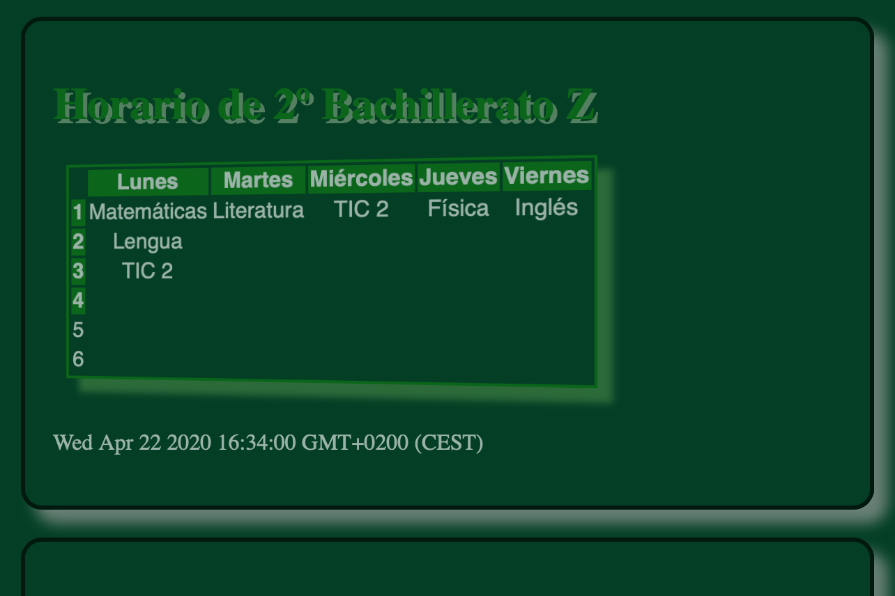

# Semana 3: CSS3 - Con un poco de estilo. Menús

## UI vs UX

Cuando usamos una aplicación o página Web, queremos que sea intuitiva, fácil de usar, rápida, sin comportamientos extraños o errores. Esto tiene que ver con la interfaz de usuario y la experiencia de usuario, dos conceptos muy importantes que debes conocer.

En el área del *márketing digital*, la experiencia de usuario o **UX** hace referencia a las interacciones que hace un usuario con una marca, sitio Web o aplicación. Su objetivo es conseguir que la interacción entre el cliente y nuestro producto o servicio sea agradable.

En el área de la *ingeniería de la usabilidad*, la interfaz de usuario o **UI** cobra especial importancia porque el diseño que hagamos de nuestro producto o Web, debe estar centrado y atractivo para el usuario. Debe ser fácil de aprender, usar y robusto (sin fallos ni comportamientos extraños, no previstos).

## Accesibilidad

Aunque se sale un poco del tema del curso, has de saber que existen una serie de normas tanto internacionales como locales sobre cómo hacer un sitio Web o una aplicación móvil accesibles a todo el mundo.

La **accesibilidad web** tiene como objetivo lograr que las páginas web sean utilizables por el máximo número de personas, independientemente de sus conocimientos o capacidades personales e independientemente de las características técnicas del equipo utilizado para acceder a la Web (Fuente: [Universidad de Alicante](http://accesibilidadweb.dlsi.ua.es)). Esto enlaza con uno de los objetivos esenciales de la Web que planteó su creador:

> "The power of the Web is in its universality. Access by everyone regardless of disability is an essential aspect" [Tim Berners-Lee](https://www.w3.org/Press/IPO-announce).

Una página Web accesible debería, al menos, de cumplir las siguientes pautas (fuente: [Universidad de Alicante](http://accesibilidadweb.dlsi.ua.es/?menu=guiabreve)):

1. Imágenes y animaciones: Use el atributo alt para describir la función de cada elemento visual.
2. Mapas de imagen: Use el elemento map y texto para las zonas activas.
3. Multimedia: Proporcione subtítulos y transcripción del sonido, y descripción del vídeo.
4. Enlaces de hipertexto: Use texto que tenga sentido leído fuera de contexto. Por ejemplo, evite "pincha aquí".
5. Organización de las páginas: Use encabezados, listas y estructura consistente. Use CSS para la maquetación donde sea posible.
6. Figuras y diagramas: Descríbalos brevemente en la pagina o use el atributo longdesc.
7. Scripts, applets y plug-ins: Ofrezca contenido alternativo si las funciones nuevas no son accesibles.
8. Marcos: Use el elemento noframes y títulos con sentido.
9. Tablas: Facilite la lectura línea a línea. Resuma.
10. Revise su trabajo: Verifique. Use las herramientas, puntos de comprobación y pautas de [Guía de accesibilidad del consorcio w3](http://www.w3.org/TR/WCAG/).

El consorcio W3C es el encargado de redactar y revisar las **Pautas de Accesibilidad al Contenido en la Web (WCAG)**. Están dirigidas a los webmasters e indican cómo hacer que los contenidos del sitio web sean accesibles.

Las [pautas WCAG 2.1](https://www.w3.org/WAI/standards-guidelines/wcag/new-in-21/es) surgen con el objetivo de mejorar la accesibilidad principalmente de tres grupos de usuarios:

* Personas con discapacidad cognitiva o del aprendizaje
* Personas con baja visión
* Personas con discapacidad que acceden desde dispositivos móviles

Para más información:

* [Introducción a las Pautas de Accesibilidad para el Contenido Web (WCAG)](https://www.w3.org/WAI/standards-guidelines/wcag/es)
* [Guía de adaptación a WCAG 2.1 desde WCAG 2.0](https://administracionelectronica.gob.es/pae_Home/dam/jcr:9c154db6-188b-4f75-a971-f8dc0e76b559/Guia_de_Adaptacion_a_WCAG_2_1_v1_0.pdf)

## Ejercicio horario de clase

Recuerda la semana pasada cómo hicimos una tabla. Esta semana te proponemos hacer el horario de clase que teníamos antes del confinamiento en formato Web para practicar y darle "estilo". Como punto de partida, si quieres, puedes usar [este modelo](docs/horario.html):

El diseño es libre. Puedes usar los colores que desees, se trata simplemente de explorar las opciones que nos ofrecen las hojas de estilo.

Crea una carpeta aparte "semana2" y hazlo ahí.

## Menús de aplicaciones

## Preparando el esqueleto de nuestra APP/Web

